# Setting up the Multitech Conduit as a LoRaWAN Network Server

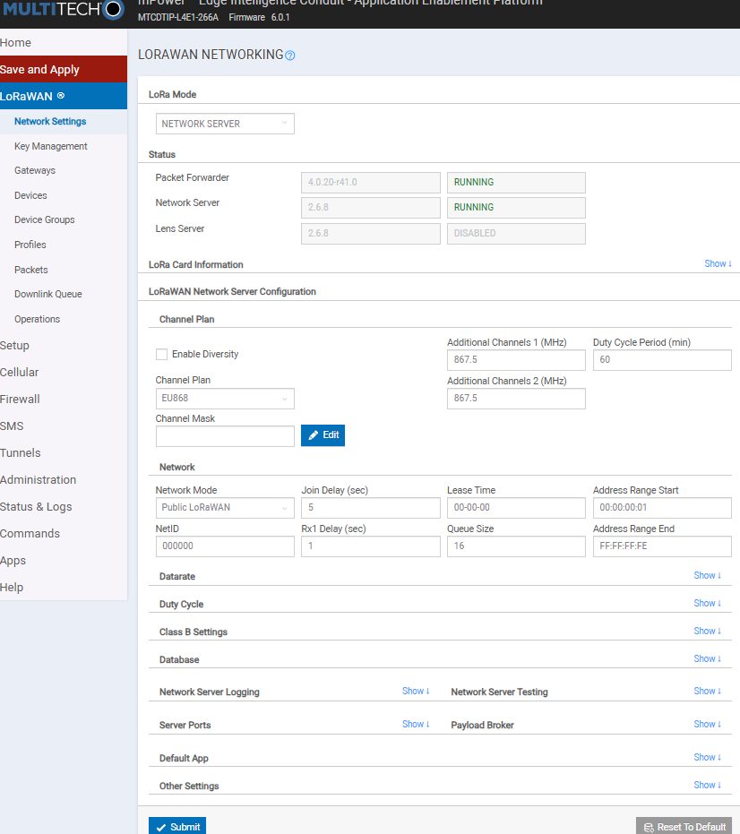

# Overview

This guide covers configuring the Multitech Conduit gateway to act as its **own LoRaWAN Network Server (NS)** — decoding device data locally on the gateway and delivering it to the CASA / `cetools` MQTT platform.

The full data path this guide builds is:

```
device (RF) → gateway NS (decode) → LOCAL mosquitto broker → MQTT bridge → mqtt.cetools.org → (decode downstream)
```

Two things are worth understanding up front, because they trip people up:

1. The NS publishes decoded uplinks to a **local** broker on the gateway (topic `lora/<DevEUI>/up`). A separate **MQTT bridge** then forwards/remaps those onto `cetools`. The NS does *not* publish straight to `cetools` (see the note in *Publishing Data to cetools* for why).
2. The uplink `data` field is the raw device payload as **base64** — decrypted, but not field-decoded. Turning it into `{species, confidence, …}` happens **downstream** (see *Decoding the Payload*).

> **Important — the mode is global, but that does not block dual routing.** On mPower the `PACKET FORWARDER` vs `NETWORK SERVER` choice applies to the **whole gateway (both cards)**, not per-card. This is a limit on *mode*, not on the number of destinations:
>
> - In **Packet Forwarder** mode each card forwards independently, so one gateway can already feed **Loriot (card 1) and TTN (card 2) at the same time**. (Sending a *single* card's traffic to *multiple* servers at once is also possible, but needs a multi-destination forwarder such as `mp_pkt_fwd` or a UDP replicator — not the stock UI.)
> - The one thing the global mode *does* prevent is running the **built-in Network Server** (this guide) on one card while another card packet-forwards — choosing Network Server switches the whole box out of forwarding.
>
> So to have **decoded MQTT (cetools) *and* raw forwarding to Loriot at the same time**, keep the Conduit in Packet Forwarder mode and run the network server **off the gateway** (e.g. ChirpStack on a separate machine). See the *Appendix*.

# Before you start

> **Verified on** a MTCDTIP-L4E1 running **mPower 6.0.1** with **LoRa Network Server 2.6.8** (two MTAC-LORA-H-868 cards, EUIs `…81:46` / `…81:47`). Menu labels and generated-config paths can differ slightly on other firmware.

Make sure you have:

- A commissioned Conduit already on the network with WAN access (see the gateway setup guide).
- Login access to the gateway's AEP / mPower web UI.

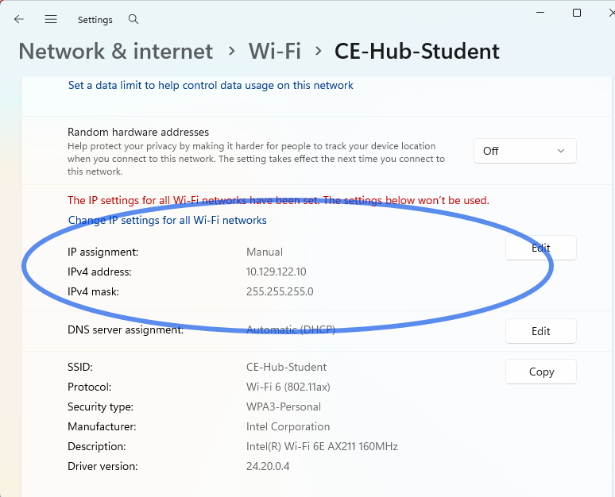

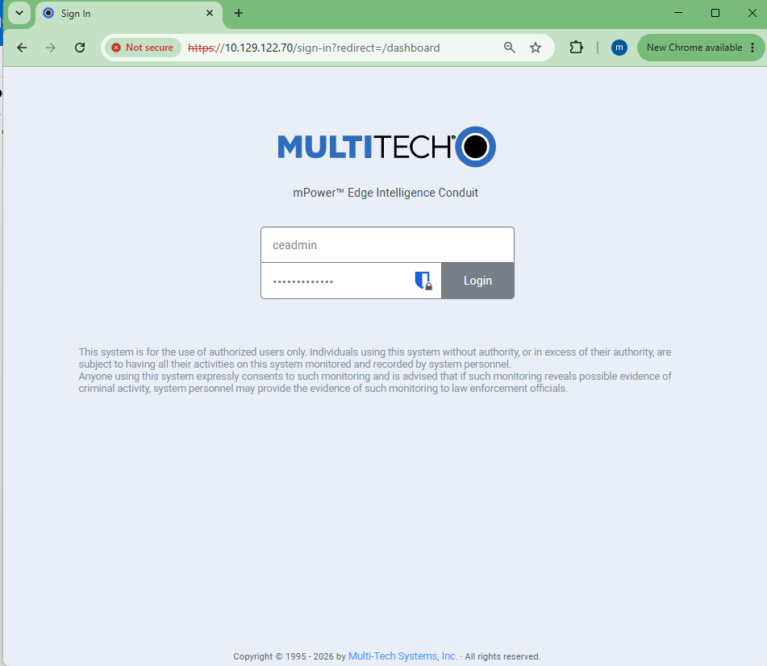

- SSH access to the gateway (`ceadmin@<gateway-ip>`) — used for verification. Enable under `Administration > Access Configuration` if needed.
- The MQTT broker details for `cetools`: host `mqtt.cetools.org`, port `1884`, a **username** (e.g. `student`) and its **password**.
- At least one LoRaWAN device with its OTAA credentials: **DevEUI**, **AppEUI (JoinEUI)** and **AppKey**.

> **Note on ports / firewall.** MQTT to `cetools` uses **outbound TCP 1884**. Confirm the site firewall allows it before troubleshooting anything else — from the gateway: `echo | nc -w3 mqtt.cetools.org 1884 ; echo rc=$?` (`rc=0` means the port is reachable). *(If you are also forwarding to Loriot, note their Semtech-UDP path is **UDP 1780**, which is a separate firewall rule.)*

# Switching the Gateway to Network Server mode

Log in to the gateway and open the **`LoRaWAN`** settings.

Set the first drop-down from `PACKET FORWARDER` to **`NETWORK SERVER`**.

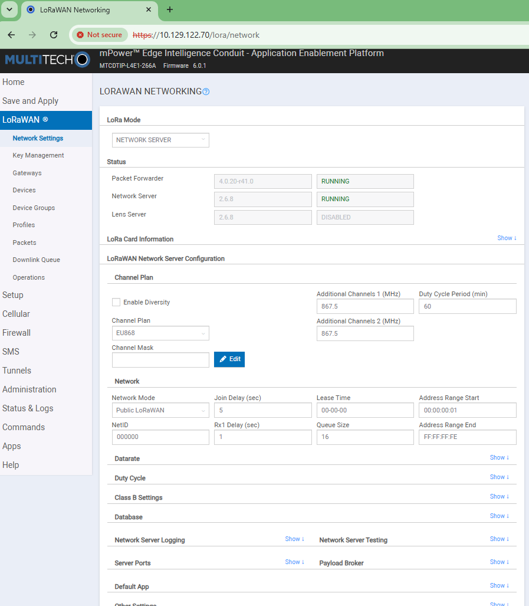
*Screenshot: the LoRaWAN page with the mode drop-down set to NETWORK SERVER.*

Check the following:

- **Channel Plan / Frequency Band**: `EU868`
- **Join type**: OTAA-vs-ABP is governed by the **Device Profile** you assign per device (`LW102-OTA-EU868`, where `OTA` = OTAA) — there is no separate page-level Join Type option.

In Network Server mode the gateway **generates the card (`global_conf.json`) configuration automatically** — you do **not** paste the `Config Card 1 / 2` text used for packet-forwarder mode.

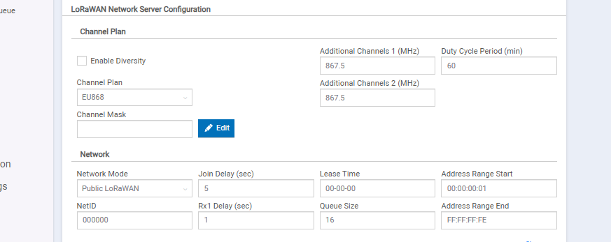
*Screenshot: the Network Server settings (channel plan / region).*

Under the **`Commands`** menu select **`Save and Apply`**, then **`Restart`** the LoRa service (or the device) so the mode takes effect.

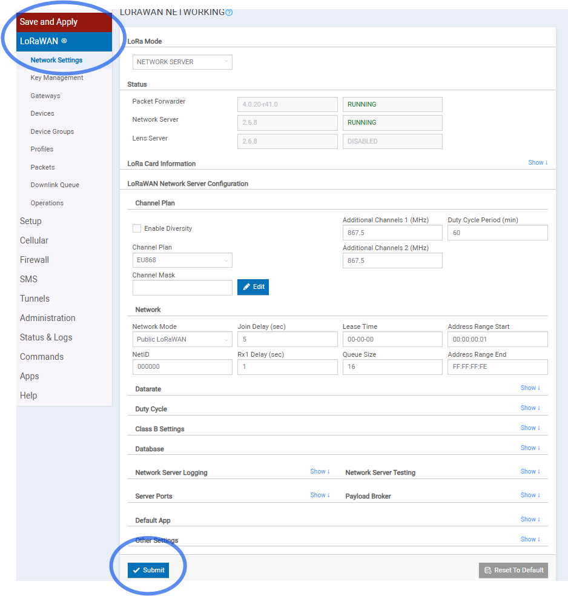
*Screenshot: Save and Apply / Restart.*

> **Always use `Save and Apply`** (the red banner), not just a section's **Submit** button. Several settings — the Payload Broker and the MQTT bridge especially — only persist and take effect after Save and Apply. A change that "didn't stick" after a reboot is almost always a Submit-without-Apply.

# Registering a Device

Registering a device is a **two-part** job on this firmware: add the device, then add its join keys (which live on a different page).

## Part 1 — Add the device

Go to **`LoRaWAN > Devices`** and select **`Add Device`**.

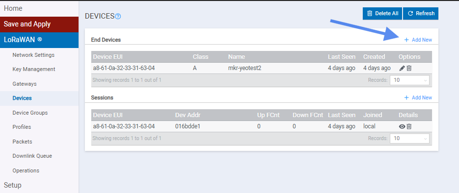
*Screenshot: the ADD DEVICE dialog.*

Fill in:

| Field | Value |
|-------|-------|
| **Dev EUI** | the device's DevEUI (e.g. `a8-61-0a-32-33-31-63-04`) |
| **Name** | a friendly name (e.g. `mkr-yeotest2`) |
| **Device Profile** | `LW102-OTA-EU868` (LoRaWAN 1.0.2, OTAA, EU868) |
| **Network Profile** | `DEFAULT-CLASS-A` |

> **Note.** This dialog has **no AppKey field** — the join keys are set separately in Key Management (Part 2). Adding the device here alone is **not enough** for it to join.

## Part 2 — Add the join credentials (Key Management)

Go to **`LoRaWAN > Key Management`**.

Set the **Join Server → Location** to **`Local Join Server`** (this keeps join handling on the gateway; the `LENS Private Join Server` option instead delegates joins to Multitech's DeviceHQ cloud and requires the keys to be provisioned there).

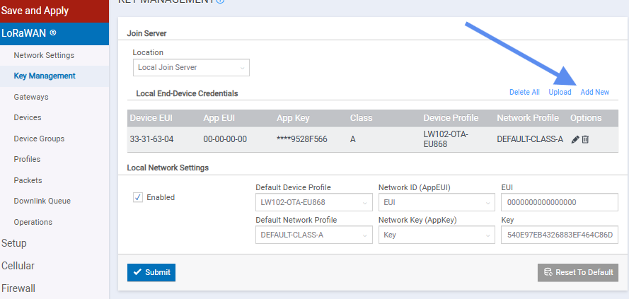
*Screenshot: Key Management, Location = Local Join Server.*

In the **`Local End-Device Credentials`** table, click **`Add New`** and enter:

| Field | Value |
|-------|-------|
| **Device EUI** | `a8610a3233316304` |
| **App EUI** | `0000000000000000` |
| **App Key** | the device's 32-character AppKey |
| **Class** | `A` |
| **Device Profile** | `LW102-OTA-EU868` |
| **Network Profile** | `DEFAULT-CLASS-A` |

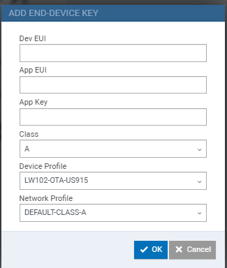
*Screenshot: the Add New credential row filled in.*

**Submit**, then re-open the page and confirm the credential row **persisted** with the App Key attached. The default `Network Key (AppKey)` / `Passphrase` fields at the bottom are a fallback for auto-provisioning and are not needed when you add an explicit per-device credential.

# (Optional) Preparing a test device — Arduino MKR WAN 1310

A known-good test transmitter is useful for proving the pipeline before real hardware. Two ready-made sketches live alongside this repo:

- `mkr_bird_ticker` *(bench node, not in this pack — main repo: `lorawan/mkr_bird_ticker/`)* — **individual detections**: 3-byte payload = `species (uint16)` + `confidence×100 (uint8)`.
- `mkr_bird_summary` *(bench node, not in this pack — main repo: `lorawan/mkr_bird_summary/`)* — **windowed summary**: `1 + 5N` bytes = `N` then per-species `species (uint16)` + cumulative counts at `≥0.70 / ≥0.60 / ≥0.50`.

Both use the same DevEUI/keys, so switching is just a reflash (the device rejoins — no re-registration).

- Read the device's factory **DevEUI** from the serial monitor at boot and use it in the registration steps above.
- Set the sketch's `appKey` to match the AppKey you entered in Key Management.
- Flash with:

```
arduino-cli compile --fqbn arduino:samd:mkrwan1310 .
arduino-cli upload -p COM9 --fqbn arduino:samd:mkrwan1310 .
```

# Verifying the Device Joins

Joins are handled by the network server, and the definitive record is the NS log. **This box logs to `/var/log/messages`** (its `logread` ring buffer is not populated — see Troubleshooting). During a join attempt:

```sh
grep -i lora-network-server /var/log/messages | tail -40
```

A successful, accepted uplink looks like:

```
ED:a8-61-0a-32-33-31-63-04|CHECK-MIC|ADDR: 01-6b-dd-e1 passed
ED:a8-61-0a-32-33-31-63-04|CHECK-PKT|FCNT: ... Duplicate: no
ED:a8-61-0a-32-33-31-63-04|PER|0.000000%
```

`CHECK-MIC passed` + an advancing `FCNT` means the device is joined and its uplinks are accepted. If it never joins, see **Troubleshooting**.

# Publishing Data to cetools

This is a **two-hop** setup, and the order matters. The NS output goes to the gateway's **local** broker first; a bridge then remaps it onto `cetools`.

> **Why not publish straight to cetools?** The NS "Payload Broker" has no topic field, so it always publishes to its fixed default topic `lora/<DevEUI>/up`. The shared `cetools` `student` account is namespaced to `student/#`, so a `lora/…` publish is **refused by the broker's ACL and silently dropped** (MQTT QoS 0 gives no error back). Publishing locally and letting the bridge **remap** the topic into `student/…` is what makes it land.

## Step 1 — Point the Payload Broker at the local broker

Go to **`LoRaWAN > Network Settings`**, expand **`Payload Broker`**, and set it to the on-box broker:

| Field | Value |
|-------|-------|
| **Enabled** | ✔ |
| **Hostname** | `127.0.0.1` |
| **Port** | `1883` |
| **Username / Password** | *(leave blank — the local broker accepts anonymous connections)* |

**Save and Apply**, then restart the NS and confirm decoded uplinks now appear on the local broker:

```sh
sudo /etc/init.d/lora-network-server restart
mosquitto_sub -h 127.0.0.1 -t 'lora/#' -v
```

You should see `lora/<DevEUI>/up` with a JSON body containing `"data"` (base64 payload), `deveui`, `fcnt`, `rssi`, `time`, plus noise topics (`packet_recv`, `geolocation`, `net_keepalive`, per-gateway and app-EUI copies). The noise stays local — it is filtered at the bridge in Step 2.


*Screenshot: Network Settings → Payload Broker, Hostname 127.0.0.1, Port 1883.*

## Step 2 — Bridge the local broker to cetools

Go to **`Administration > MQTT Broker Configuration`**:

| Field | Value |
|-------|-------|
| **Enabled** | ✔ |
| **Primary Server** | `mqtt.cetools.org` |
| **Primary Port** | `1884` |
| **Authentication** | User ID and Password |
| **User ID** | `student` |
| **Password** | *(the cetools `student` password)* |
| **Enable TLS** | off |

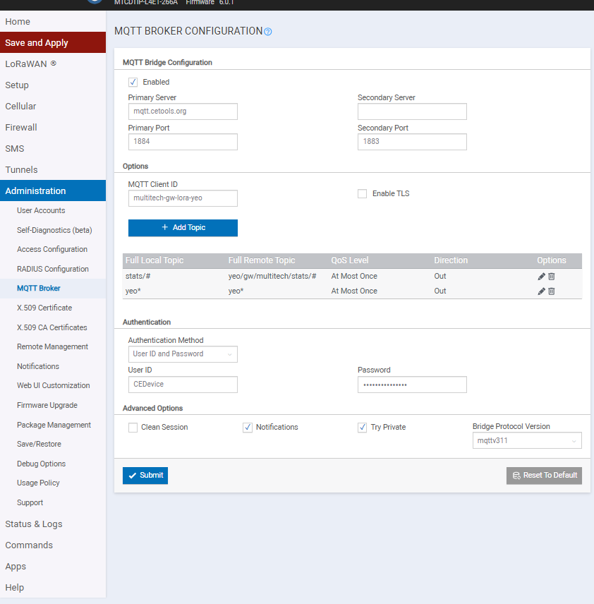
*Screenshot: Administration → MQTT Broker Configuration, connection to mqtt.cetools.org:1884.*

Then **`+ Add Topic`** to remap the local `lora` topic into the `student/…` namespace:

| Field | Value |
|-------|-------|
| **Full Local Topic** | `lora/+/up` |
| **Full Remote Topic** | `student/yeo/` |
| **QoS** | At Most Once |
| **Direction** | Out |

**Save and Apply.** Result on cetools: `student/yeo/lora/<DevEUI>/up`.

> **Tested vs recommended.** `lora/+/up` → `student/yeo/` is the clean recommended rule (one message per detection). The form first verified on this hardware was the broader `lora/#` → `student/yeo/lora/`, which also works but forwards the noise topics and doubles the prefix (`student/yeo/lora/lora/<DevEUI>/up`). Either is valid — the rule that matters is **wildcard in the Full Local Topic only, plain prefix in Full Remote**. Always confirm the generated line with the `cat` check below.

> **⚠️ The topic-rule gotcha — this will stop mosquitto from starting if you get it wrong.** mosquitto forbids a wildcard (`#`/`+`) in a bridge topic **prefix**, and **one bad bridge line stops the entire broker** (symptom: `mosquitto_sub -h 127.0.0.1` → `Connection refused`).
> - **Put the wildcard only in the Full Local Topic** (`lora/+/up`), and keep the **Full Remote Topic a plain prefix with no wildcard** (`student/yeo/`).
> - After any bridge edit, verify the generated file has the wildcard in the *pattern*, not the prefix:
>   ```sh
>   cat /var/run/config/mosquitto/conf.d/mosquitto-bridge.conf
>   # good:  topic lora/+/up out 0 "" student/yeo/
>   # BAD:   topic "" out 0 lora/# student/yeo/lora/#   <-- wildcard in prefix, broker won't start
>   ```

> **Why `lora/+/up`?** It matches only the clean decoded uplink `lora/<DevEUI>/up` — dropping `net_keepalive`, `packet_recv`, `geolocation`, and the app-EUI duplicate. That cuts roughly **6× the traffic crossing the WAN/cellular link**, with zero on-gateway compute. See *Bandwidth & the cellular relay*.

# Verifying Data on cetools

From any machine that can reach the broker (or in **MQTT Explorer**):

```sh
mosquitto_sub -h mqtt.cetools.org -p 1884 -u student -P '<password>' -t 'student/yeo/#' -v
```

You should see the clean uplink:

```
student/yeo/lora/a8-61-0a-32-33-31-63-04/up  {"data":"AUZY", "deveui":"a8-61-0a-...", "fcnt":42, "rssi":-45, "time":"..."}
```

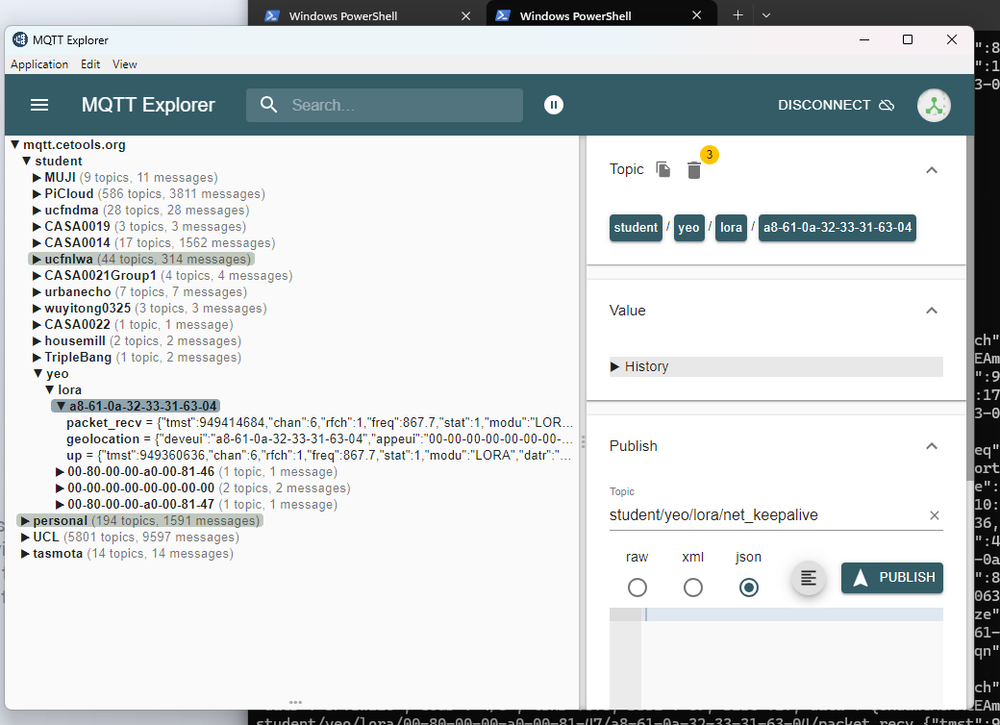
*Screenshot: the `…/lora/<DevEUI>/up` message and its `data` field in MQTT Explorer.*

The `data` field is the raw device payload (base64) — here `AUZY` decodes to species **326** at confidence **0.88**. Turning it into `{species, confidence, …}` is the next section.

# Decoding the Payload (downstream)

**Recommendation: keep the gateway "dumb" — forward the raw (filtered) uplink and decode in the application layer downstream.** This is the conventional LoRaWAN pattern (TTN "uplink formatter", ChirpStack "device-profile codec", Loriot "output decoder" all decode *after* the gateway). It keeps one maintained copy of the decoder, keeps gateways simple/robust, and decouples them from the payload schema.

## Payload formats

| Format | Bytes | Layout |
|---|---|---|
| **Detection** | 3 | `species (uint16 BE)` · `confidence×100 (uint8, 70–91)` |
| **Summary** | `1 + 5N` | `N` · per species: `species (uint16 BE)` · `count ≥0.70` · `count ≥0.60` · `count ≥0.50` (cumulative, nested) |

## Decoder

Base64-decode `data`, then apply the format:

```js
// Node-RED function node (or reuse the logic anywhere)
const b = Buffer.from(msg.payload.data, 'base64');
let out;
if (b.length === 3) {
  out = { type:'detection', species:(b[0]<<8)|b[1], confidence:b[2]/100 };
} else {
  const n=b[0], d=[]; for (let k=0,i=1;k<n;k++,i+=5){ d.push({species:(b[i]<<8)|b[i+1], ge70:b[i+2], ge60:b[i+3], ge50:b[i+4]}); }
  out = { type:'summary', detections:d };
}
out.device_id = msg.payload.deveui; out.time = msg.payload.time;
msg.payload = out;
msg.topic = 'student/yeo/decoded/' + out.device_id;   // publish clean JSON back onto cetools
return msg;
```

Run this **downstream** — a Node-RED flow on a server, a cetools-side codec, or the standalone Python listener `decode_listener.py` *(not in this pack — main repo: `lorawan/decode_listener.py`)* (`pip install paho-mqtt; python decode_listener.py`), which prints decoded detections/summaries live. Do **not** run it on the gateway unless bandwidth forces it (below).

# Bandwidth & the cellular relay (optional)

For a gateway on a metered cellular backhaul you want the least data crossing the SIM.

1. **The big win needs no compute:** the `lora/+/up` bridge filter (Step 2) means only the single decoded `/up` message crosses the link — the ~5 noise/duplicate topics stay on the local broker. This alone is a ~6× reduction.
2. **Usually stop there.** What remains is one ~400-byte message (LoRaWAN metadata around your ~30-byte payload) per uplink — negligible for occasional detections. Measure before optimising further.
3. **Only if a SIM budget genuinely bites:** decode + strip metadata **on the gateway** and publish a compact `{deveui, species/counts, time}`. Do this with a **light** always-on republisher — a `mosquitto_sub | while read | mosquitto_pub` shell loop or a small Python script subscribed to local `lora/+/up` — **not** Node-RED (too heavy for the Conduit). This re-introduces app logic on the gateway, so treat it as a deliberate relay-only variant.

# Troubleshooting

A collection of things that caused confusion during setup.

> **Log source: `/var/log/messages`, not `logread`.** This box uses rsyslog; `logread` returns `can't find syslogd buffer`. Use:
> ```sh
> grep -i lora-network-server /var/log/messages | tail -60
> grep -i mosquitto           /var/log/messages | tail -30
> ```

> **`ps` does not list the LoRa processes.** `ps | grep lora` comes back empty even when the NS and forwarders are running. Trust the syslog and the ACK/FRAME-RX lines instead, never `ps`.

**Network server won't stay running / device shows "never seen".**
Confirm it is actually up via `/var/log/messages`, then restart:
```sh
sudo /etc/init.d/lora-network-server restart
```
A healthy start logs `Lora Network Server started, Version: 2.6.8`, both cards, and `Database ... loading`.

**A device transmits but never joins.** Watch the verdict during a join:
```sh
grep -iE 'JOIN|REJECT|ACCEPT|MIC|unknown|nonce' /var/log/messages | tail -40
```
- `REJECTED ... unknown device` → the credential isn't stored / didn't save (redo Key Management, Part 2). Verify with `lora-query --help` → list devices and confirm the AppKey is attached.
- `MIC` / bad mic → the **AppKey** on the gateway doesn't match the device.
- `nonce` / DevNonce → **replay protection.** The NS has `enableStrictCounterValidation: true`; repeatedly resetting a device during testing can make it re-send an old DevNonce. Delete + re-add the device to clear its join state, or relax strict validation.

> **DevEUI byte order.** The NS config uses `"joinByteOrder": "LSB"`, so it may log the DevEUI **byte-reversed** (`04-63-31-33-32-0a-61-a8`). When searching the log, anchor on the `JOIN`/`REJECT`/`MIC` words, not the DevEUI.

**`mosquitto_sub -h 127.0.0.1` → `Connection refused`.** The broker is down — almost always a bad **bridge topic rule**. Confirm with:
```sh
sudo mosquitto -c /etc/mosquitto/mosquitto.conf -v   # prints the exact bad line, then Ctrl-C
```
If it reports `Invalid bridge topic local prefix 'lora/#'`, the rule has a wildcard in the prefix. **Fix in the UI** (Administration → MQTT Broker Configuration → delete/repair the topic row → Save and Apply) — the file at `/var/run/config/mosquitto/conf.d/mosquitto-bridge.conf` is regenerated from the UI, so hand-edits don't persist. See the topic-rule gotcha in *Publishing Data to cetools*.

**`mosquitto_sub -h localhost` → `Cannot assign requested address`.** Transient — services/loopback still settling right after a Save and Apply. Wait ~60 s and retry with `-h 127.0.0.1`.

**NS accepts uplinks but nothing reaches cetools.** The Payload Broker is publishing straight to `cetools` (`lora/…`, blocked by the `student` ACL) instead of to the local broker. Point it at `127.0.0.1:1883` (Step 1) and let the bridge remap (Step 2). Confirm data exists locally first: `mosquitto_sub -h 127.0.0.1 -t 'lora/#' -v`.

**Inspect the live NS config** (device whitelist, MQTT/Payload Broker settings, `joinByteOrder`, etc.):
```sh
cat /var/config/lora/lora-network-server.conf
```

# Appendix — Operating modes: Network Server vs Packet Forwarder

The gateway can run in one of two LoRaWAN modes, and the choice is **global** (both cards share it — see the note at the top). The key difference is **where the LoRaWAN decode happens**.

## Network Server mode — decode *on the gateway*

This is the mode described in this guide.

- The gateway **is** the LoRaWAN network server: it handles the OTAA join, decrypts the payload, and tracks each device's session.
- Devices **join the gateway**, and their keys live **on the gateway** (Key Management → Local Join Server).
- You get **decoded** data on the gateway's local MQTT broker (`lora/<DevEUI>/up`), bridged out to `cetools`.
- Self-contained — no external network server needed for the decode.

## Packet Forwarder mode — decode *delegated* to an external LNS

- The gateway does **no decoding**. It relays raw RF frames (encrypted `PHYPayload` + radio metadata) over UDP to an external LNS — Loriot, TTN, ChirpStack, etc.
- The **LNS** performs the join, decryption and session management. Devices are provisioned **on the LNS**.
- Each card forwards **independently**, so the two cards can point at **two different LNS at once** (Loriot + TTN in parallel).
- At the gateway itself the data is **raw/encrypted only**.

## Side-by-side

| | Network Server (on-device decode) | Packet Forwarder (delegated decode) |
|---|---|---|
| Where decoding happens | On the gateway | On the external LNS |
| Where device keys live | On the gateway (Key Management) | On the LNS |
| Data available *at the gateway* | Decoded (local MQTT) | Raw / encrypted only |
| Destinations | One (the gateway's own NS) | One per card natively; two cards → two LNS |
| Internet needed for decode | No (local) | Yes (must reach the LNS) |
| Who owns / manages devices | The gateway | The LNS operator |
| Typical use | Data straight onto local MQTT / `cetools` | Send to Loriot / TTN / ChirpStack; central device mgmt |

## Combining both (decoded MQTT *and* Loriot at the same time)

Because the mode is global, you cannot run the built-in Network Server on one card while another card forwards to Loriot. To have **both** live at once, keep the gateway in **Packet Forwarder** mode and move the decode **off the box**:

```
              card 1 (Packet Forwarder) ──────────────▶ Loriot (uk1)
Conduit  ┤
              card 2 (Packet Forwarder) ──▶ ChirpStack (separate box) ──▶ decode ──▶ mqtt.cetools.org
```

The decode is *delegated* to ChirpStack (which publishes decoded data to MQTT just like this guide's local NS), while the Conduit stays a forwarder and Loriot keeps receiving raw frames on the other card.

# End Notes

Related material:

- Gateway (packet-forwarder) setup — see the main Conduit gateway README.
- Test device sketches — `mkr_bird_ticker` *(bench node, not in this pack — main repo: `lorawan/mkr_bird_ticker/`)* (detections) and `mkr_bird_summary` *(bench node, not in this pack — main repo: `lorawan/mkr_bird_summary/`)* (summary).
- Downstream decoder — `decode_listener.py` *(not in this pack — main repo: `lorawan/decode_listener.py`)*.
- [Conduit AEP software guide](https://www.multitech.com/documents/publications/software-guides/s000727--mPower-Edge-Intelligence-Conduit-AEP-software-guide.pdf)

> Screenshots referenced above go in the `img/` folder next to this file. Filenames follow the `image-N` sequence used in the steps.
