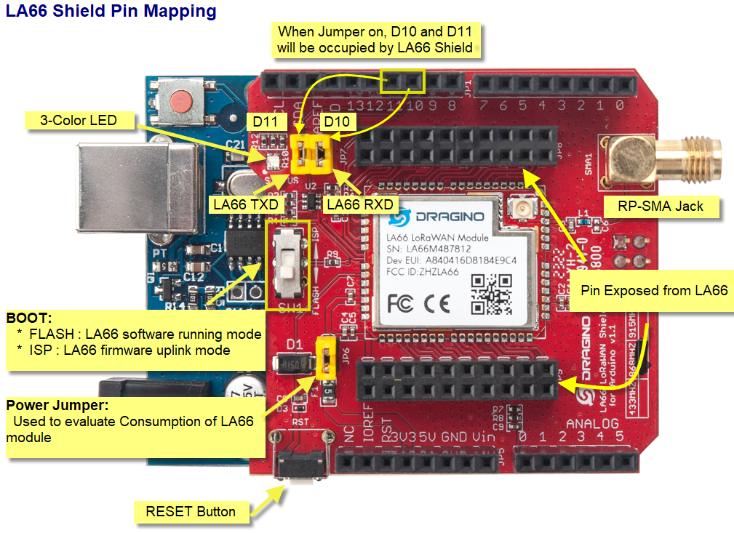
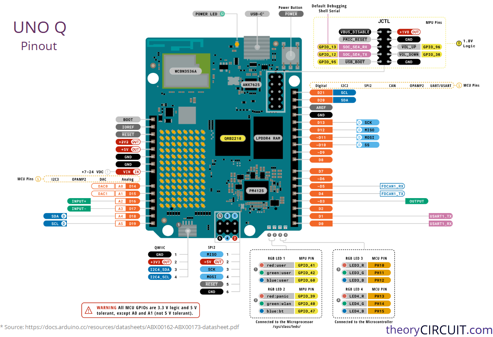

# Uno Q to Dragino LA66 LoRaWAN Bridge Configuration
This repository contains the configuration scripts and architecture overview for running direct, bi-directional LoRaWAN communications from the Linux MPU core of the Arduino Uno Q to a Dragino LA66 LoRa Shield running the DR-LWS-007 stack.

## Hardware Architecture & Wiring
Because the Linux core (Debian) on the Uno Q does not have direct copper traces mapped to the external digital headers, all communication must route through the onboard microcontroller (MCU) core acting as a transparent proxy.

### 1. Jumper Selection
Remove the default vertical plastic jumper blocks from the D10/D11 flash positions on the Dragino shield.

Set the physical slide switch on the Dragino shield to FLASH mode.

### 2. Manual Cross-Wiring Pins
Use DuPont diagnostic wires to bridge the inner gold breakout pins of the shield directly to the Uno Q hardware UART edges:

- Shield Inner TXD → Uno Q Pin 1 (Hardware TX)

- Shield Inner RXD → Uno Q Pin 0 (Hardware RX)

Note: Unlike a standard serial cross-over rule (TX→RX), the internal routing topology of the Uno Q requires patching TXD to Pin 1 and RXD to Pin 0 to align with how the Linux serial daemon handles incoming/outgoing character buffers.

## The Software Pipeline
The communication follows a three-stage multiplexed path:

- The Python Script connects to a local loopback network socket hosted by the OS.
- The system's native arduino-router service manages /dev/ttyHS1 and maps that local socket to the internal MCU bus.
- An active Arduino Pass-Through Sketch running on the MCU swaps bytes between the internal Serial line (Linux link) and Serial1 (Physical Pins 0 & 1).

### Repository Code Utilities

### 1. la66-sniff.py
A simple, one-way network sniffer tool used to confirm data is making it up the chain.

Usage: Run this script and press the physical RST button on the Dragino Shield.

Expected Output: It dumps the precise incoming hex sequence from the shield's bootloader, ending in the network registration confirmation string (JOINED).

### 2. la66-socket.py
An interactive command-line utility for manually firing raw AT commands into the shield from an SSH session without killing core system daemons.

It forces input text to uppercase and appends the strict \r\n carriage return and line feed structure required by the Dragino command-line parser.

Note: I never managed to get a response to the command AT but did get responses from AT+CFG and others.

### 3. la66-send-byte.py
The production automation framework utility. It converts a raw list of integers/bytes (e.g., [0x00, 0xFA]) into an uppercase hexadecimal string chunk and cleanly structures the required layout:

`AT+SENDB=0,⟨fport⟩,⟨length⟩,⟨hex_string⟩`

## Step-by-Step Initial Setup Checklist

- Flash the MCU Proxy Sketch `lora-linux-bridge.ino`: Upload Arduino sketch to the board that pipes data continuously between Serial and Serial1 at 9600 baud. Make sure it clears the cold boot floating RX line using an initial INPUT_PULLUP window.

- Wire the Board: Ensure TXD is on Pin 1 and RXD is on Pin 0.

- Verify the Daemon is Alive: Confirm the background service is hosting the loopback interface on port 7500: Bash `sudo ss -tulpn | grep 7500`

- Test the Uplink Pipe: Run `python3 la66-sniff.py` and trigger a physical button reset on the shield. Look for the JOINED stream.

- Transmit: Execute `pythons3 la66-send-byte.py` and verify the Base64 frame arrives intact at the Network Server dashboard (e.g., The Things Network console).